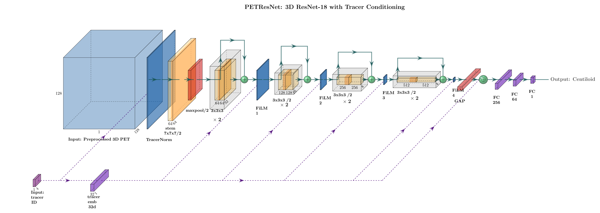

<p align="center">
  
</p>

<h1 align="center">MYGO-Centiloid</h1>
<p align="center">
  <b>M</b>ultitracer-conditioned 3D ResNet18 for am<b>Y</b>loid β-PET centiloid re<b>G</b>ressi<b>O</b>n
</p>

<p align="center">
   <b>1st prize</b> at the
  <a href="https://medaihack.org/"><b>MedAI Spring 2026 Hackathon</b></a>
  organized by the
  <a href="https://github.com/vkola-lab/medaihack"><b>Kolachalama Lab, Boston University</b></a>.
</p>

<p align="center">
  <b>Team 25 — It's MYGO!!!!!!</b><br/>
  <a href="https://github.com/JimmyToluene">Haozhe Jia</a> ·
  <a href="https://github.com/Yujie-Jessie">Yujie Hu</a> ·
  <a href="https://github.com/ayiii-a">Zijiang Zhao</a> ·
  <a href="https://github.com/karthikayanidevaraj">Karthikayani Devaraj</a> ·
  Shruthi Ashok ·
  Sathvika Mallavarapu
</p>

<p align="center">
  <a href="https://www.python.org/downloads/"></a>
  <a href="https://pytorch.org/"></a>
  <a href="https://medaihack.org/"></a>
  <a href="https://opensource.org/licenses/MIT"></a>
</p>

---
Our team predict continuous Centiloid scores from preprocessed 3D amyloid β-PET
volumes (`(1, 128, 128, 128)`, four tracers: **FBP**, **FBB**, **NAV**, **PIB**),
trained on the MedAI Spring 2026 Hackathon Challenge 2 data (2,000 train + 500 val,
NACC + A4 cohorts). 

The pipeline is specifically designed to handle the
extreme right-skew and 64.8 % negative-class imbalance in the Centiloid
distribution.

> **External test set (final, official):** MAE **12.555 CL**. \
> **Validation leaderboard:** MAE **11.7916 CL** — a **40.4 %** MAE reduction over the 3D CNN baseline (19.77 CL) provided by the hackathon organizers. Pearson r (internal) = 0.936.

<p align="center">
  
</p>

Our model `PETResNet` combines:
- **3D ResNet-18** backbone with **FiLM** conditioning at every residual stage;
- **TracerNorm** per-tracer learned (γ, β) intensity rescale, which we subsequently found to parallel the per-tracer affine structure of published Centiloid calibration equations (Klunk et al. 2015; Navitsky et al. 2018; Rowe et al. 2016, 2017)
- **Tracer embedding** concatenated into our 3-layer regression head;
- **Huber + Pearson** combined loss trained with an inverse-frequency
  `WeightedRandomSampler` over six Centiloid bins.

> We motivated every design decision with an empirical finding, documented in [`eda/`](eda/README.md) and recorded in each script's `Justifies:` header.

---

## Contents

1. [Results](#results)
2. [Ongoing Work](#ongoing-work) → [`ablations/`](ablations/README.md)
3. [Quick start](#quick-start)
4. [Repository Structure](#repository-structure)
5. [Architecture](#architecture)
6. [Data](#data)
7. [Outputs](#outputs)
8. [Submission & Evaluation](#submission--evaluation)
9. [Disclaimer](#disclaimer)
10. [License](#license)
11. [References](#references)

---

## Results

We compared our `PETResNet` against the unmodified starter baseline on
the validation set (n = 500).

| | 3D CNN baseline | **MYGO (ours)** |
|---|-----------------|---|
| **Overall MAE (external test, official)** | — | **12.555 CL** |
| **Overall MAE (val leaderboard, final)** | 19.77 CL | **11.7916 CL** |
| **Overall Pearson r (internal)** | 0.790 | **0.936** |

**Improvement (val leaderboard):** MAE 19.77 → 11.79 (−7.98 CL, **40.4 % reduction**).

**Per-tracer breakdown (internal `dev/evaluate.py`):**

| Tracer | N | Baseline 3D CNN MAE | **MYGO MAE** | Baseline 3D CNN r | **MYGO r** |
| ------ | --- |---------------------| ------------ |-------------------| ---------- |
| **ALL** | 500 | 19.77               | **11.73** | 0.790             | **0.936** |
| FBP | 236 | 19.28               | **11.49** | 0.797             | **0.930** |
| FBB | 114 | 20.04               | **12.37** | 0.804             | **0.933** |
| PIB | 133 | 21.17               | **11.94** | 0.790             | **0.939** |
| NAV | 17  | 13.86               | **9.28** | 0.946             | **0.981** |

> Per-tracer rows are from our internal eval script on the 500-subject
> validation split (weighted average 11.73 CL). The val-leaderboard
> number is **11.7916 CL**; the 0.06 CL delta vs. our internal script
> reflects differences in the scoring scripts and is expected. \
> The **official competition score on the held-out external test set**
> is **12.555 CL** — reported separately because the test split is not
> available locally for per-tracer breakdown.

---
## Ongoing Work

Following the hackathon, we ran a post-hoc **factorial ablation** over
the three tracer-conditioning sites in `PETResNet` — TracerNorm (input),
FiLM (per-stage), and tracer-embedding GAP concat (head) — to isolate
each one's contribution. All numbers below are from internal
`dev/evaluate.py` on the same 500-subject validation split, so ablation
rows are comparable apples-to-apples against the submission's internal
11.73 CL. The **final** competition score remains the leaderboard
11.7916 CL reported above.

| Variant | TracerNorm | FiLM | GAP concat | Val MAE | Δ vs submission |
|---|:-:|:-:|:-:|:-:|:-:|
| Submission (`PETResNet`)             | ✓ | ✓ | ✓ | 11.79 | — |
| `PETResNetNoGAP` (`−GAP`)            | ✓ | ✓ | — | 10.83 | −0.96 |
| `PETResNetNoFiLM` (`−FiLM`)          | ✓ | — | ✓ | 10.49 | −1.30 |
| `PETResNetTracerNormOnly`            | ✓ | — | — | **9.03** | **−2.76** |

Key findings:

- **TracerNorm alone is sufficient.** With FiLM and the GAP concat both
  removed, the 8 learned (γ_t, β_t) scalars in TracerNorm carry the
  cross-tracer conditioning load on their own and achieve the lowest
  internal MAE.
- **FiLM is the dominant capacity sink.** Its removal is the single
  intervention that restores physical alignment between learned γ_t and
  the published CL-per-SUVR conversion slopes (Pearson r flips from
  −0.71 to +0.69; further removing the GAP concat sharpens it to +0.93).
- **Predictive performance and physical interpretability decouple.** The
  −GAP and −FiLM variants land within 0.34 CL of each other but have
  *opposite* γ_t-vs-slope correlations — MAE alone is not evidence for
  interpretability.

See [`ablations/`](ablations/) for per-variant configs, the write-up in
[`ablations/studies/tracer_conditioning.md`](ablations/studies/tracer_conditioning.md),
and the TracerNorm parameter-inspection script. The competition
submission (`PETResNet` with all three conditioning sites,
**leaderboard MAE 11.7916 CL**) remains the canonical reference.

---

## Quick start

### Environment Setup
#### BU SCC
```bash
module load medaihack/spring-2026
module load python3/3.12.4

# Create venv (one-time) — name must match the path hardcoded in predict.sh
virtualenv /projectnb/medaihack/team25/venv_name
source /projectnb/medaihack/team25/venv_name/bin/activate

git clone https://github.com/vkola-lab/medaihack.git
cd medaihack/ABPET
pip install -r requirements.txt
pip install -e .
```

> If you prefer a different venv name, update both this command **and**
> line 28 of `predict.sh` so the judges' inference script activates the
> right environment.

For **OnDemand** (Jupyter / Code Server): load the two modules in the
module list and place the `source` command in the pre-launch dialog box.

#### Outside BU SCC

```bash
git clone https://github.com/vkola-lab/medaihack.git
cd medaihack/ABPET
python -m venv .venv && source .venv/bin/activate
pip install -r requirements.txt && pip install -e .
```
### Usage

Environment Setup above already handled `pip install`. From here:

```bash
# 1. Link data (BU SCC — one-liner, no copy)
ln -s /projectnb/medaihack/ABPET/data data

# 2. Train → Predict → Evaluate  (configs in dev/config/*.yaml)
bash dev/train.sh                                          # uses dev/config/train.yaml
python dev/predict.py --config dev/config/predict.yaml
python dev/evaluate.py --pred results/predictions.csv --gt data/val.csv

# 3. End-to-end inference (judge entry point)
bash predict.sh data/val.csv checkpoints/best_model.pt predictions.csv

# 4. EDA
bash eda/run_all.sh                                        # pre-train (01-03)
bash eda/run_all.sh --pred_csv results/predictions.csv     # + post-train (04)
```

Outside BU SCC, place the dataset at `data/` (or symlink):
```
data/
├── train.csv
├── val.csv
└── npy_files/
```

See [`ablations/`](ablations/README.md) for post-hoc studies (No-FiLM
variant, stage-4 attention) that are not part of the canonical submission.

For an in-browser demo dashboard — upload a `.npy` PET volume and view
axial / coronal / sagittal slices alongside the model's prediction —
open [`front_end/index.html`](front_end/index.html). Pure static HTML +
JS, no server. This is optional and not on the evaluation path.

---

## Repository Structure

```text
ABPET/
├── mygo_centiloid/               # Installable Python package
│   ├── model/                        PETResNet + factorial ablation variants
│   │   ├── petresnet.py                     canonical model (TracerNorm + FiLM + GAP concat)
│   │   ├── petresnet_no_gap.py              ablation: TracerNorm + FiLM
│   │   ├── petresnet_no_film.py             ablation: TracerNorm + GAP concat
│   │   └── petresnet_tracer_norm_only.py    ablation: TracerNorm only
│   ├── losses/losses.py              CentiloidLoss, get_criterion
│   ├── data/dataset.py               PETDataset
│   ├── data/augmentation.py          build_train_transform (per-tracer strength)
│   └── utils/run_logger.py           training logger
│
├── dev/                          # Runnable scripts + config (canonical pipeline)
│   ├── train.py                      training loop (AMP, weighted sampler, CosineWR)
│   ├── predict.py                    inference → predictions.csv
│   ├── evaluate.py                   MAE / RMSE / Pearson r report
│   ├── train.sh                      launcher (single --config arg)
│   ├── experimental_fet/
│   │   └── gradcam.py                HiResCAM over axial / coronal / sagittal slices
│   └── config/
│       ├── train.yaml                canonical training hyperparameters
│       └── predict.yaml              inference paths + batch settings
│
├── ablations/                    # Post-hackathon studies (see ablations/README.md)
│   ├── README.md                     index + headline results
│   ├── configs/
│   │   ├── no_gap.yaml               −GAP       (TracerNorm + FiLM)
│   │   ├── no_film.yaml              −FiLM      (TracerNorm + GAP concat)
│   │   └── tracer_norm_only.yaml     TN-only    (TracerNorm only)
│   ├── scripts/
│   │   ├── ablate_tracer_norm.py     toggle TracerNorm → identity at inference
│   │   └── inspect_tracer_norm.py    dump learned γ / β per tracer
│   └── studies/
│       └── tracer_conditioning.md    4-variant factorial write-up
│
├── eda/                          # EDA suite (see eda/README.md)
│   ├── 01_centiloid_distribution.py  pre-train: target distribution
│   ├── 02_tracer_comparison.py       pre-train: per-tracer intensity profiles
│   ├── 03_calibration_analysis.py    pre-train: tracer ↔ Centiloid calibration
│   ├── 04_model_error_analysis.py    post-train: residuals + failure modes
│   └── run_all.sh                    one-click runner
│
├── figures/                      # architecture diagram + logo
├── front_end/                    # optional static HTML dashboard — upload .npy, view slices + CL prediction
│
├── predict.sh                    # judge entry point → dev/predict.py
├── setup.py                      # pip install -e .
├── requirements.txt
├── LICENSE
└── README.md
```

After `pip install -e .`:

```python
from mygo_centiloid import PETResNet, PETDataset, CentiloidLoss, get_criterion, build_train_transform
```

---

## Architecture

```text
Input: (B, 1, 128, 128, 128) + tracer_id (B,)
          │
          ▼
     TracerNorm            per-tracer learned (γ, β)
          │
          ▼
    Stem: Conv3d(1→64, 7³, s=2) → BN → ReLU → MaxPool3d(s=2)
          │                                                     TracerEmbedding
          ▼                                                       (4 → 32)
    Stage 1: ResBlock×2 (s=1) + FiLM  →  (B,  64, 32, 32, 32)  ◄──┤
    Stage 2: ResBlock×2 (s=2) + FiLM  →  (B, 128, 16, 16, 16)  ◄──┤
    Stage 3: ResBlock×2 (s=2) + FiLM  →  (B, 256,  8,  8,  8)  ◄──┤
    Stage 4: ResBlock×2 (s=2) + FiLM  →  (B, 512,  4,  4,  4)  ◄──┘
          │
          ▼
    Global Average Pool  →  (B, 512)
          │
          ▼
    Concat[image_feat ‖ tracer_emb]  →  (B, 544)
          │
          ▼
    FC(544→256) → BN → GELU → Dropout(0.4)
    FC(256→ 64) → BN → GELU → Dropout(0.2)
    FC( 64→  1)   ← linear (CL can be negative)
          │
          ▼
    Centiloid prediction (B,)
```

**Footprint:** ~33.4 M trainable parameters (3D ResNet-18 backbone
dominates; TracerNorm + FiLM + head ≈ 0.2 M). Fits on a single
NVIDIA L40S at `batch_size=4` with AMP enabled.

**Loss:** 
`CentiloidLoss = α · Huber(δ=25) + (1−α) · (1 − Pearson r)`, α = 0.7.

**Training**

- **Optimizer:** AdamW (lr = 1e-4, weight decay = 1e-4)
- **Scheduler:** CosineAnnealingWarmRestarts (T₀ = 20, T_mult = 2)
- **Precision:** automatic mixed precision (AMP) via `torch.amp`
- **Gradient clipping:** max norm 1.0
- **Sampler:** 6-bin `WeightedRandomSampler` (inverse frequency over Centiloid bins)
- **Early stopping:** patience = 20 epochs on val MAE
- **Schedule:** 100 epochs, batch size 4, ≈ 500 iters / epoch on the 2,000-sample train split.

**Augmentation** 

Per-tracer strength:
1. **STRONG** for NAV / PIB (n < 100), **standard** for FBP / FBB. 
2. All transforms preserve `(1, 128, 128, 128)` shape and clamp to `[0, 1]`.

- `RandFlipLR` — left–right flip (brain is bilaterally symmetric)
- `RandAffine3D` — small rotation + translation
- `RandGamma` — intensity gamma jitter
- `RandBiasShift` — additive per-volume bias
- `RandGaussianNoise` — voxel-wise Gaussian noise

---

## Data

| Split | Cohorts | N | Breakdown |
|-------|---------|---|-----------|
| Train | NACC + A4 | 2,000 | 1,195 NACC + 805 A4 |
| Val   | NACC + A4 | 500   | 305 NACC + 195 A4 |

Each sample is a preprocessed `.npy` volume with an associated Centiloid score and tracer label.

### Schema

| Column | Type | Description |
|--------|------|-------------|
| `ID` | str | Subject identifier |
| `npy_path` | str | Path to `(1, 128, 128, 128)` float32 `.npy`, range `[0, 1]` |
| `CENTILOIDS` | float | Regression target (typically −50 to 200+) |
| `TRACER.AMY` | str | Radiotracer: `FBP`, `FBB`, `NAV`, `PIB` |

### Why tracer matters

| Code | Full name | N (train+val) |
|------|-----------|---------------|
| `FBP` | Florbetapir | 1,182 |
| `FBB` | Florbetaben | 568 |
| `NAV` | Florbetanav | 85 |
| `PIB` | Pittsburgh Compound B | 665 |

Each tracer binds to amyloid with different affinity and produces different
uptake patterns. The Centiloid scale harmonizes across tracers, but the raw
images still differ — our `TracerNorm` + `FiLM` conditioning addresses this.

### Preprocessing already applied

All images were preprocessed from raw NIfTI PET scans (we did **not** redo
any of these). The following steps were applied in order:

1. **Channel first** — `(C, H, W, D)` format.
2. **RAS orientation** — standard neuroimaging alignment.
3. **Isotropic resampling** — 2 mm × 2 mm × 2 mm, trilinear.
4. **Foreground cropping** — 10-voxel margin via MONAI `CropForeground`.
5. **Resize** — `128 × 128 × 128`, trilinear.
6. **Spatial padding** — to exactly 128³ if needed.
7. **Dynamic frame averaging** — multi-frame PET → single static volume.
8. **Shape enforcement** — final center-crop/pad to `(1, 128, 128, 128)`.
9. **Min-max normalization** — `img = (img - img.min()) / (img.max() - img.min())`.

---

## Outputs

Training runs are organized under `logs/<UTC-stamp>_<run_name>/`. The
UTC timestamp is **always** prefixed (even when `run.name` is set in the
YAML) so re-running the same config never collides with an earlier run's
`epoch_log.csv`. Inference and EDA outputs live under `results/`.

```
logs/
├── 20260423-233325_ablation_tracer_norm_only/    one folder per train run
│   ├── config.json                               full config + git commit + host + argv
│   ├── epoch_log.csv                             per-epoch: train_loss, val_mae, val_r, lr
│   ├── metrics.json                              final summary (best MAE, r, epochs, ckpt paths)
│   └── checkpoints/
│       ├── best_model.pt                         lowest val MAE
│       └── last_model.pt                         most recent epoch
└── runs.jsonl                                    global append-only registry (one JSON line per run)

results/
├── predictions.csv                               from dev/predict.py
└── eda/
    ├── pre_train/                                from scripts 01–03 (data analysis)
    │   ├── 01_centiloid_distribution/
    │   ├── 02_tracer_comparison/
    │   └── 03_calibration_analysis/
    └── post_train/                               from script 04 (model error analysis)
        └── 04_model_error_analysis/
```

Each EDA folder contains `*.png` figures and a `*.txt` summary report
with auditable numbers. The judges' `predict.sh` entry point still reads
the submission checkpoint from `checkpoints/best_model.pt` (the
hackathon-mandated path, not a training output).

---

## Submission & Evaluation

Our submission follows the hackathon's standard entry point. Judges
clone the repo and run:

```bash
bash predict.sh <test.csv> <checkpoint.pt> predictions.csv
```

`predict.sh` activates our team venv at
`/projectnb/medaihack/team25/venv_name/bin/activate` and calls
`dev/predict.py` with the provided CSV and checkpoint. The output
`predictions.csv` contains `ID`, `npy_path`, `TRACER.AMY`, and
`PREDICTED_CENTILOIDS` columns.

**Scoring metrics** (same as the hackathon baseline):

* **Primary:** Mean Absolute Error (MAE) in centiloid units
* **Secondary:** Pearson correlation coefficient

**Checklist for reproducibility:**

1. Best checkpoint at `checkpoints/best_model.pt` (lowest val MAE).
2. `predict.sh` has the team venv path hardcoded (line 28).
3. `dev/predict.py` instantiates `PETResNet` from
   `mygo_centiloid.model.petresnet`.
4. Smoke test: `bash predict.sh data/val.csv checkpoints/best_model.pt predictions.csv`
   produces a 500-row CSV without errors.

---

## Disclaimer

This software and any trained model weights distributed with it are
provided **for academic and research purposes only**. They are **not a
medical device** and have **not** been validated or approved by the
U.S. Food and Drug Administration (FDA), the European Medicines Agency
(EMA), or any other regulatory body.

**The model and its inferences must not be used to inform clinical
diagnosis, treatment decisions, prognosis, or any patient-care
workflow.** The training data (2,000 hackathon samples across four
tracers) is too small and too narrow to support any clinical claim, and
the model has undergone no prospective or external validation.

Any use of this software or its outputs in a clinical setting is the
sole responsibility of the user.

---

## License

Released under the **MIT License** — see [`LICENSE`](LICENSE) for the
full text, including the research-use-only notice.

All code in `mygo_centiloid/`, `dev/`, and `ablations/` is original to this
project; no third-party code carrying a copyleft or non-commercial license
was incorporated.

---

## References

Citations for the prior work that directly informed each MYGO component.

### Architecture

1. **He K, Zhang X, Ren S, Sun J.** Deep Residual Learning for Image
   Recognition. *CVPR* 2016. — the 2D ResNet-18 backbone we extend to 3D.
   [arXiv:1512.03385](https://arxiv.org/abs/1512.03385)
2. **Hara K, Kataoka H, Satoh Y.** Can Spatiotemporal 3D CNNs Retrace the
   History of 2D CNNs and ImageNet? *CVPR* 2018. — empirical basis for
   using 3D ResNets on volumetric data at our scale.
   [arXiv:1711.09577](https://arxiv.org/abs/1711.09577)
3. **Perez E, Strub F, de Vries H, Dumoulin V, Courville A.** FiLM:
   Visual Reasoning with a General Conditioning Layer. *AAAI* 2018. —
   the `FiLMBlock` at every ResNet stage (tracer-conditioned γ, β).
   [arXiv:1709.07871](https://arxiv.org/abs/1709.07871)
4. **Dumoulin V, Shlens J, Kudlur M.** A Learned Representation for
   Artistic Style. *ICLR* 2017. — conditional instance normalization,
   the conceptual precursor to our input-level `TracerNorm`.
   [arXiv:1610.07629](https://arxiv.org/abs/1610.07629)
5. **Ioffe S, Szegedy C.** Batch Normalization: Accelerating Deep Network
   Training by Reducing Internal Covariate Shift. *ICML* 2015. —
   `BatchNorm3d` in the stem, every `ResBlock3D`, every downsample
   shortcut, and `BatchNorm1d` in the regression head.
   [arXiv:1502.03167](https://arxiv.org/abs/1502.03167)

### Loss and optimization

6. **Huber PJ.** Robust Estimation of a Location Parameter. *Annals of
   Mathematical Statistics* 1964;35(1):73–101. — Huber term in
   `CentiloidLoss` with `δ=25` ≈ Centiloid IQR.
7. **Loshchilov I, Hutter F.** Decoupled Weight Decay Regularization
   (AdamW). *ICLR* 2019.
   [arXiv:1711.05101](https://arxiv.org/abs/1711.05101)
8. **Loshchilov I, Hutter F.** SGDR: Stochastic Gradient Descent with
   Warm Restarts. *ICLR* 2017. — `CosineAnnealingWarmRestarts(T_0=20, T_mult=2)`.
   [arXiv:1608.03983](https://arxiv.org/abs/1608.03983)
9. **Micikevicius P, et al.** Mixed Precision Training. *ICLR* 2018. —
   AMP autocast + GradScaler in `dev/train.py`.
   [arXiv:1710.03740](https://arxiv.org/abs/1710.03740)
10. **Buda M, Maki A, Mazurowski MA.** A systematic study of the class
    imbalance problem in convolutional neural networks.
    *Neural Networks* 2018;106:249–259. — motivation for our six-bin
    `WeightedRandomSampler` on Centiloid.

### Medical-imaging augmentation

11. **Pérez-García F, Sparks R, Ourselin S.** TorchIO: a Python library
    for efficient loading, preprocessing, augmentation and patch-based
    sampling of medical images in deep learning. *Computer Methods and
    Programs in Biomedicine* 2021;208:106236. — reference for
    per-tracer-strength 3D augmentation choices in
    `mygo_centiloid/data/augmentation.py`.
    [doi:10.1016/j.cmpb.2021.106236](https://doi.org/10.1016/j.cmpb.2021.106236)

### Domain — amyloid PET and the Centiloid scale

12. **Klunk WE, et al.** The Centiloid Project: standardizing
    quantitative amyloid plaque estimation by PET. *Alzheimer's &
    Dementia* 2015;11(1):1–15. — the regression target; source of the
    positivity threshold (24.4 CL) used throughout `eda/`.
    [doi:10.1016/j.jalz.2014.07.003](https://doi.org/10.1016/j.jalz.2014.07.003)
13. **Jagust WJ, et al.** The Alzheimer's Disease Neuroimaging Initiative
    2 PET Core: 2015. *Alzheimer's & Dementia* 2015;11(7):757–771. —
    reference preprocessing pipeline for amyloid PET.
    [doi:10.1016/j.jalz.2015.05.001](https://doi.org/10.1016/j.jalz.2015.05.001)

### Related Kolachalama Lab work

14. **Qiu S, et al.** Multimodal deep learning for Alzheimer's disease
    dementia assessment. *Nature Communications* 2022;13:3404. — the
    lab's 3D-CNN + fusion precedent for structural brain imaging.
    [doi:10.1038/s41467-022-31037-5](https://doi.org/10.1038/s41467-022-31037-5)
    · [vkola-lab/ncomms2022](https://github.com/vkola-lab/ncomms2022)
15. **Kolachalama Lab.** AI-driven fusion of multimodal data for
    Alzheimer's disease biomarker assessment. *Nature Communications*
    2025. — the lab's current amyloid/τ multimodal framework; its
    `image_processing/pet_pipeline.sh` is the upstream amyloid-PET
    reference pipeline.
    [doi:10.1038/s41467-025-62590-4](https://doi.org/10.1038/s41467-025-62590-4)
    · [vkola-lab/ncomms2025](https://github.com/vkola-lab/ncomms2025)
